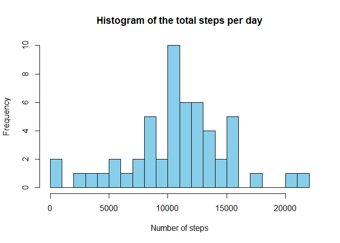
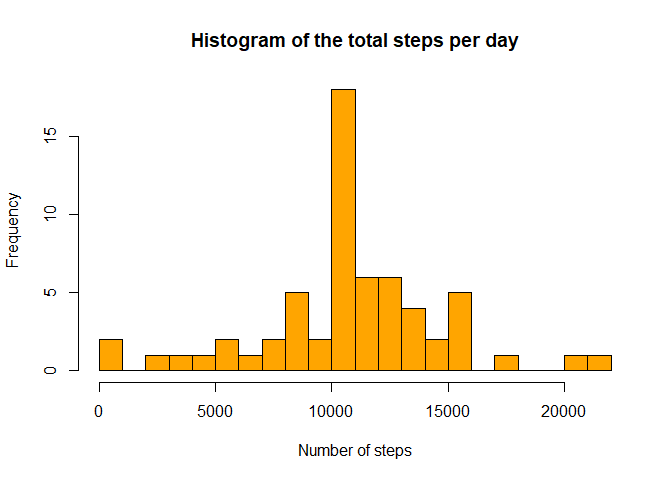

This report corresponds to the Course Project 1 of course 'Reproducible Research'.  

## Loading and preprocessing the data
First, load the data frame and take a quick look at its structure:


```r
steps_data = read.csv("activity.csv")
str(steps_data)
```

```
## 'data.frame':	17568 obs. of  3 variables:
##  $ steps   : int  NA NA NA NA NA NA NA NA NA NA ...
##  $ date    : Factor w/ 61 levels "2012-10-01","2012-10-02",..: 1 1 1 1 1 1 1 1 1 1 ...
##  $ interval: int  0 5 10 15 20 25 30 35 40 45 ...
```

It seems suitable for analysis. 'steps' variable has many NA, but I'll deal with that later.

## What is mean total number of steps taken per day?
For this part of the assignment, I'll ignore the missing values.

First, sum the number of steps per day and plot an histogram of the data:


```r
daily_steps = data.frame(total.steps = tapply(steps_data$steps, steps_data$date, sum))
hist(daily_steps$total.steps, breaks = 20, 
     xlab = "Number of steps", 
     main = "Histogram of the total steps per day", 
     col = "skyblue")
```

<!-- -->

Now, let's get the mean and median of the data:

```r
paste("Mean: ", round(mean(daily_steps$total.steps, na.rm = T)), "steps")
```

```
## [1] "Mean:  10766 steps"
```

```r
paste("Median: ", median(daily_steps$total.steps, na.rm = T), "steps")
```

```
## [1] "Median:  10765 steps"
```

## What is the average daily activity pattern?
First, let's look at how many steps, on average, the individual takes per each 5-minute interval (ignoring again the NAs).


```r
int_steps = tapply(steps_data$steps, steps_data$interval, mean, na.rm = T)
interval_steps = data.frame(interval = as.numeric(names(int_steps)), steps = int_steps)
    plot(interval_steps$interval, interval_steps$steps, type = "l",
         xlab = "5-minute interval of the day",
         ylab = "Average number of steps",
         main = "Average steps per interval of the day",
         col = "darkblue")
```

<!-- -->

Find the interval of the day where the individual takes on average the largest number of steps:

```r
interval_steps[which.max(interval_steps$steps), 1]
```

```
## [1] 835
```

## Imputing missing values
First, find the total number of missing values and their % in the data set:

```r
ok = complete.cases(steps_data)
sum(!ok)
```

```
## [1] 2304
```

```r
sum(!ok)/nrow(steps_data)
```

```
## [1] 0.1311475
```
In order to find a filling strategy, let's first see how the missing values occur:

```r
ok_per_day = data.frame(not_ok = tapply(ok, steps_data$date, sum))
table(ok_per_day)
```

```
## ok_per_day
##   0 288 
##   8  53
```

We can see that either the days have **all values missing** (8 days) or have **all the values present** (53 days). Possibly on those 8 days the individual didn't turn on the activity monitoring device.

Since there is no information about any specific patterns of the individual, it seems reasonable to fill the missing data with the average of the days where data is available, for each 5-minute interval.


```r
steps_data_filled <- steps_data ## Create a new data set

## For each NA, fill the new data set with the average number of steps in that interval across all days (rounded)
for (i in 1:nrow(steps_data)) {
    if (is.na(steps_data$steps[i])) 
            steps_data_filled$steps[i] = round(interval_steps$steps[interval_steps$interval == steps_data$interval[i]])
}
```

Now, create an histogram with the new data and find the new mean and median values:

```r
daily_steps = data.frame(total.steps = tapply(steps_data_filled$steps, steps_data_filled$date, sum))
hist(daily_steps$total.steps, breaks = 20, 
     xlab = "Number of steps", 
     main = "Histogram of the total steps per day", 
     col = "orange")
```

<!-- -->

```r
paste("New Mean: ", round(mean(daily_steps$total.steps, na.rm = T)), "steps")
```

```
## [1] "New Mean:  10766 steps"
```

```r
paste("New Median: ", median(daily_steps$total.steps, na.rm = T), "steps")
```

```
## [1] "New Median:  10762 steps"
```

We can see that the **mean** and **median** is the same as before, while the **median** changed from 10765 to 10762. The histogram is slighly different, since those 8 days previously without data are now filled.

## Are there differences in activity patterns between weekdays and weekends?
Plot the average steps in each 5-minute interval, both for weekdays and for weekends:


```r
library(dplyr)
library(lattice)
```


```r
## Insert a new factor variable in the dataset indicating whether a given date is a weekday or weekend
## *** PLEASE NOTE THAT THE WEEKEND DAYS ARE IN PORTUGUESE. 
## *** YOU NEED TO CHANGE THE NAMES TO YOUR SYSTEM'S LANGUAGE TO RUN THE CODE
steps_data_filled$weekday = factor(ifelse(weekdays(as.Date(steps_data_filled$date)) 
                                          %in% c("sábado", "domingo"), 
                                          "WEEKEND", "WEEKDAY"))

## Summarize the data per interval and type of day
mean_data <- steps_data_filled %>% group_by(weekday, interval) %>% summarize(mean.steps = mean(steps))

## Construct the plot
xyplot(mean.steps ~ interval | weekday, data = mean_data, layout = c(1, 2), type = "l",
       xlab = "Interval of the day",
       ylab = "Number of steps",
       main = "Average number of steps per interval of the day")
```

<!-- -->
The data shows a different pattern in weekdays and weekends. In weekends, there is more activity during the day, whereas in weekdays there is a larger peak in the morning and less activity during the day.
This might be due to the person walking to work every morning and then mostly sitting during the day, while on weekends the person is active throughout the whole day.


